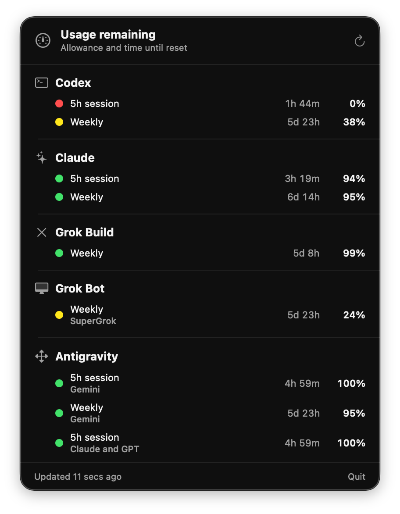

# Agent Allowance

A small native macOS menu-bar app that shows the allowance remaining for Codex, Claude, Cursor, Devin, Grok Build, Grok Bot, and Antigravity (`agy`). It reports both the percentage remaining and the time until each available limit resets.



## What it reads

- **Codex:** the authenticated local Codex app-server rate-limit method.
- **Claude:** the Claude Code OAuth usage endpoint and the existing Claude Code credential.
- **Cursor:** its current billing-cycle usage endpoint, using Cursor's existing local sign-in and device identity.
- **Devin:** the current daily, weekly, or billing-cycle allowance stored in Devin's local signed-in status. Expired cached windows are omitted until Devin refreshes them.
- **Grok Build:** the Grok CLI billing endpoint and the existing Grok CLI credential. Only its reported weekly pool is displayed.
- **Grok Bot:** its separate SuperGrok usage pool, using Grok Bot's existing local Keychain-backed sign-in.
- **Antigravity:** `agy -p "/usage"`, which reports separate Gemini and Claude/GPT pools.

The app does not submit model prompts. Credentials are read only when refreshing and are never stored by Agent Allowance.

## Requirements

- macOS 14 or newer
- Swift 6 / Xcode Command Line Tools
- At least one supported agent installed and signed in

You do not need all seven. **Agents you have not installed are hidden**, so the
popover only lists what you actually use. An agent that is installed but signed
out is still listed, with a line telling you how to sign in — those are the
errors worth acting on. If no agent is found at all, the popover says so.

## Setting up each provider

Each provider reuses the sign-in that its own tool already stores. Agent
Allowance never asks for credentials and never stores them.

| Provider | Install | Sign in | Allowance shown |
|---|---|---|---|
| **Codex** | `codex` CLI | `codex login` | 5-hour session and weekly |
| **Claude** | `claude` CLI (Claude Code) | `claude login` | 5-hour session and weekly, per model where the plan has one |
| **Cursor** | Cursor desktop app | Sign in inside Cursor | Current billing cycle |
| **Devin** | Devin desktop app | Sign in inside Devin | Daily, weekly, or billing cycle |
| **Grok Build** | `grok` CLI | `grok login` | Weekly |
| **Grok Bot** | Grok Bot desktop app | Sign in inside Grok Bot | Weekly SuperGrok pool |
| **Antigravity** | `agy` CLI | Sign in inside `agy` | Gemini and Claude/GPT pools |

Provider-specific notes:

- **Claude** reads the first credential it finds: the `CLAUDE_CODE_OAUTH_TOKEN`
  environment variable, then `~/.claude/.credentials.json`, then the
  `Claude Code-credentials` Keychain item. A normal Claude Code sign-in is
  enough — the environment variable is only useful when running from a shell,
  since an app launched from Finder inherits no shell environment.
- **Claude** shows every limit the usage endpoint reports for your plan: the
  5-hour session, the weekly all-models pool, and any model-scoped weekly pool
  (shown as a second `Weekly` row named after the model). Plans with a single
  weekly pool keep one unqualified `Weekly` row.
- **Grok Bot** decrypts its `Grok Bot Safe Storage` Keychain item, so macOS asks
  once whether Agent Allowance may use it. Allow it, or Grok Bot stays blank.
- **Devin** has no live endpoint; it reads the status Devin cached at its last
  sign-in. Windows whose reset time has passed are dropped, so if Devin is
  stale, open it once and refresh.

### If a provider you installed does not appear

Agent Allowance looks for CLIs in `~/.local/bin`, `/opt/homebrew/bin`,
`/usr/local/bin`, `/usr/bin`, and `/bin`, plus whatever is on `PATH`. An app
launched from Finder does not inherit your shell's `PATH`, so a CLI installed
somewhere else — a version manager's shim directory, for example — is treated
as not installed and hidden. Symlink it into one of those directories to make
it visible.

## Build and run

```sh
./scripts/package_app.sh
open build/AgentAllowance.app
```

The packaged app is written to `build/AgentAllowance.app`. It is ad-hoc signed and has `LSUIElement` enabled, so it appears only in the menu bar and not in the Dock.

## Reading the display

All percentages mean **allowance remaining**:

- Green: 50–100% remaining
- Yellow: 20–49% remaining
- Red: under 20% remaining

Tap the menu-bar gauge to refresh data that is more than a minute old, or use the refresh button for an immediate update.

## License

Released under the [MIT License](LICENSE).

Agent Allowance is an independent project and is not affiliated with, endorsed
by, or sponsored by any provider it supports. Provider and product names are
trademarks of their respective owners and are used here only to identify the
services whose allowances the app displays. The app relies on local credentials,
local status data, and provider endpoints that may change at any time without
notice, and it is provided as is, without warranty of any kind.
